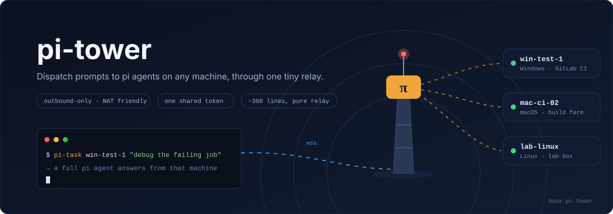

# pi-tower



Control tower for remote [pi](https://github.com/earendil-works/pi) runners. Register a headless pi on any machine, then let an interactive pi session anywhere dispatch tasks to it by name — like calling a remote coding agent as a tool.

```
┌─────────────────────────── laptop (interactive) ─────────────────────────────────┐
│  process: pi (interactive TUI)                                                   │
│  ┌────────────────────────────────────────────────────────────┐                  │
│  │  extension.ts                                              │                  │
│  │  ├─ registerFlag("--tower", "--tower-token")               │                  │
│  │  └─ registerTool("runner_list", "runner_task")             │                  │
│  │       execute() ──── wss ────────────────────────────────────────┐            │
│  └────────────────────────────────────────────────────────────┘     │            │
└─────────────────────────────────────────────────────────────────────┼────────────┘
                                                                      │
                                              wss (RPC JSONL frames, token auth)
                                                                      │
┌───────────────────────────── tower (any VPS) ───────────────────────┼────────────┐
│  process: pi-tower (tower.mjs)                                      ▼            │
│  ┌────────────────────────────────────────────────────────────┐                  │
│  │  registry: { "win-test-1" → runner socket, ... }           │                  │
│  │  pure relay: client frames ──→ runner, runner ──→ client   │                  │
│  │  one attached client per runner at a time                  │                  │
│  └──────────────────────────────▲─────────────────────────────┘                  │
└─────────────────────────────────┼────────────────────────────────────────────────┘
                                  │
              wss outbound (runner dials out, NAT/firewall friendly)
                                  │
┌────────────────────────── runner PC (e.g. CI box) ─┼─────────────────────────────┐
│  process: pi-runner (runner.mjs)                   │                             │
│  ┌─────────────────────────────────────────────────┴──────────┐                  │
│  │  pi-runner --hq wss://hq.example.com --id win-test-1       │                  │
│  │  pipes: wss frame ↔ child stdin/stdout (LF JSONL)          │                  │
│  └───────────────┬────────────────────────────────────────────┘                  │
│                  ▼                                                               │
│  child process: pi --mode rpc   (full agent, tools run locally)                  │
└──────────────────────────────────────────────────────────────────────────────────┘
```

## Setup

Everything lives in this package; runners and the laptop also need `pi` installed.

**Tower (VPS)**

```sh
npx pi-tower --port 9000 --token <shared-token>   # or PI_TOWER_TOKEN env
```

**Runner PC**

```sh
npx pi-runner --hq wss://hq.example.com --id win-test-1 --token <shared-token> -- --no-session
```

Args after `--` go to the spawned `pi --mode rpc`. The runner dials out and reconnects every 3s, so it works behind NAT. `--id` defaults to the hostname.

**Laptop**

pi-tower is a pi package bundling the extension (`runner_task` / `runner_list` tools) and the `remote-runner` skill. Install once:

```sh
pi install git:github.com/<you>/pi-tower   # or npm:pi-tower, or /local/path
pi -e /local/path                          # try without installing (this run only)
```

Then start pi with the tower flags and prompt "use runner_task on win-test-1 to ...":

```sh
pi --tower wss://hq.example.com --tower-token <shared-token>
```

Providers with a direct API key see the extension tools natively. Providers that run their agent loop server-side (and never expose extension tools) get the `remote-runner` skill instead, which teaches the model the `pi-task` CLI below.

## pi-task CLI

Some providers run their agent loop server-side and never expose extension-registered tools to the model. `pi-task` is the provider-agnostic fallback: any agent (or human) dispatches with one shell command instead of the extension tools.

```sh
export PI_TOWER_URL=wss://hq.example.com PI_TOWER_TOKEN=<shared-token>
pi-task --list                    # who's online
pi-task win-test-1 "run the failing job and report the error"
```

stdout carries only the final answer, so `$(pi-task ...)` captures cleanly; progress streams to stderr only in an interactive terminal, keeping piped output clean for agent callers. `--fresh` starts a fresh session on the runner first; Ctrl-C forwards an abort to the runner.

pi users get discovery via the bundled `remote-runner` skill automatically. For non-pi agents, add a line to the project's AGENTS.md instead:

```md
Remote runner tasks: `pi-task <runner-id> "<prompt>"`; list runners: `pi-task --list` (env: PI_TOWER_URL, PI_TOWER_TOKEN).
```

## Wire contract

The tower is a pure relay: each WebSocket text frame is one pi RPC JSONL record (see pi's `docs/rpc.md`), untouched in both directions.

| Endpoint | Purpose |
|----------|---------|
| `GET /` | health, returns `pi-tower` |
| `GET /runners?token=t` | JSON `[{id, connectedAt, busy}]` |
| `WS /runner?id=<id>&token=t` | runner registration; same id reconnect replaces the old socket |
| `WS /attach?runner=<id>&token=t` | client attachment, one per runner |

| Close code | Meaning |
|-----------|---------|
| 4001 | bad token |
| 4004 | unknown runner (reason lists online ids) |
| 4005 | runner busy (another client attached) |
| 4006 | runner disconnected while attached |

## Security

Single shared token checked on every upgrade and HTTP request. Run the tower behind a TLS reverse proxy (caddy/nginx) so the public URL is `wss://`; the token and all traffic are plaintext otherwise. Anyone with the token can drive any runner — runners execute arbitrary commands, so treat the token like an SSH key.

## Verify

```sh
npm run verify
```

Four assert-based scripts: tower relay semantics (fake runner), full chain through a real `pi --mode rpc` (no LLM call), the extension's tools plus the `pi-task` CLI driven against a fake runner, and pi-package loading via `pi -e .` (extension flag registered, skill listed).
